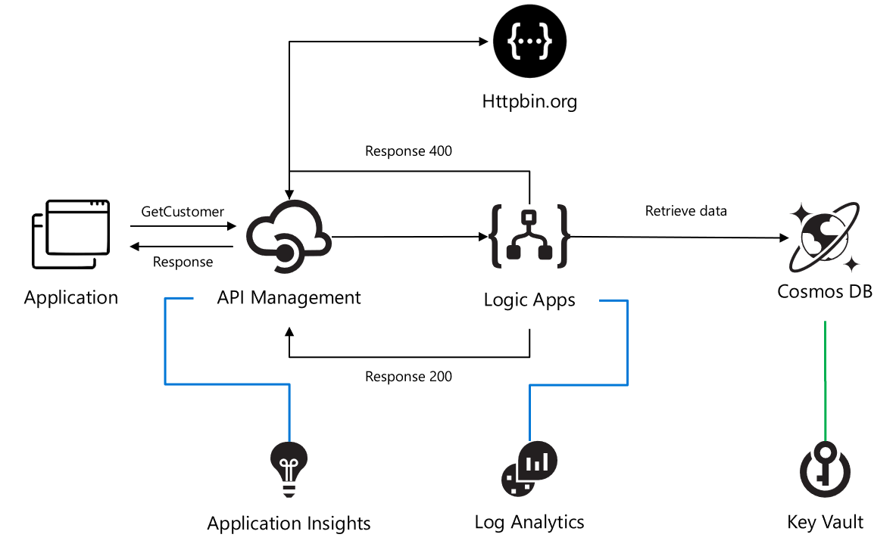

# ais-sync-pattern
A fully automated DevOps deployment of an synchronous pattern with Azure Integration Services. Setup with services like: API Management, Logic Apps, Key Vault (to store connections strings and keys for API Connections), Cosmos DB, Application Insights (for logging and monitoring API Management) and Log Analytics (for logging metrics from Logic Apps).

The architecture is based on the Basic Enterprise integration pattern:
https://docs.microsoft.com/en-us/azure/architecture/reference-architectures/enterprise-integration/basic-enterprise-integration

I've used API Management GUI to create the API. And, I've used the Extract Tool to create the defnition for my API:
https://github.com/Azure/azure-api-management-devops-resource-kit

https://azure.microsoft.com/en-us/blog/build-a-ci-cd-pipeline-for-api-management/

## Azure Architecture

The architecture uses Logic Apps to orchestrate the API workflow and API Management to create and publish the API.
This architecture is sufficient for basic integration scenarios where the workflow is triggered by synchronous calls to backend services. A more sophisticated architecture using queues and events builds on this basic architecture (https://github.com/pascalvanderheiden/ais-async-pattern) 

This architecture focusses on retrrieving data from a Cosmos DB and returning that query in the response.

In this case I've used Cosmos DB to get the messages from, but this can be replace with any backend application / database.

In DevOps with the build pipeline all shared resources are deployed. The release pipeline deploys the specific services needed for this pattern. In this way are able to deploy, by cloning, multiple sync pattern, using the same shared components for cost optimalization.

In this DevOps project I've made it possible to deploy to 3 environments by choice. So, you can deploy to a dev, staging and production enviroment in the DevOps project. There are 3 build pipelines which wil provide the deployment of completely seperate enviroments. All shared components are deployed in the build pipelines. In the release pipeline we will do a staged deployment of each environment, with a approval in between. This way you can choose if you want to deploy duplicate environments or not.  

## Step by Step installation

### Before we hit it off
This integration returns data from Cosmos DB. This database is not pre-populated. You can implement the asynchronous pattern first, to get data in via the API (https://github.com/pascalvanderheiden/ais-async-pattern). Or you can just add data manually via the Data Explorer in the Azure Portal. There is a sample json included in this repository.

Another important note: if you've already implemeted the asynchronous pattern (https://github.com/pascalvanderheiden/ais-async-pattern), this tutorial will be complementary to that setup.

### Step 1: In the Azure Portal create a Service Principal
In the Azure Cloud Shell (https://shell.azure.com): 
- az ad sp create-for-rbac --name [your-service-principal-name]

Copy the JSON Output! We'll be needing this information to create the service connection in Azure DevOps.

### Step 2: Generate your Azure DevOps Project for Continuous Integration & Deployment with the Azure DevOps Generator
- In the devops folder of this repo the Azure DevOps template is included. Download it.
- Login with your account and open the DevOps Generator: https://azuredevopsdemogenerator.azurewebsites.net/environment/createproject?enableextractor=true
- Choose a custom template and point to the zip-file in the devops folder. This repo will be imported into Azure DevOps and Pipelines are created for you.

The project is split-up into 2 pieces; shared resources & integration specific resources. Enabling you to extend your project with more integration and re-using the shared resources for cost efficiency.

You can find the documentation on the Azure DevOps Generator here: https://vstsdemodata.visualstudio.com/AzureDevOpsDemoGenerator/_wiki/wikis/AzureDevOpsGenerator.wiki/58/Build-your-own-template

### Step 3: In Azure DevOps, create a service connection
- Login with your account Azure DevOps. Go to the Project Settings of the DevOps Project you've created in step 2.
- Go to Service Connections*.
- Create a new service connection, choose Azure Resource Manager, next.
- Select Service Principal (manual).
- Fill in the Subscription Id, Subscription Name.
- Copy the appId from step 1 in "Service Principal Id" and the password from step 1 in "Service Principal key". Give the service connection a name and verify the connection.
- Tick "Grant access permission to all pipelines. Save.

### Step 4: In Azure DevOps, update the Variables Group.
- Go to Pipelines, Library. Click on the Variable group "Shared Resources".
- Tick "Allow access to all pipelines.
- Update the values of the variables to match your naming conventions needs. I've put in some generic naming, but you need to update the variables. Otherwise, the creation of some services will fail, because they've been already used.
- The variable "KVCOSMOSDBLABEL" is used as a label for Key Vault to retrieve the connection string and key for API Connections. Leave that as it is: "aissharedcosmosdb"
- Do the same for the "Environments" Variable group.
- Don't forget to save.

### Step 5: In Azure DevOps, update the Build pipeline and Run it.
- Go to Pipelines, Pipelines.
- Select "Build AIS shared resources-env1-CI", Edit.
- In Tasks, select the Tasks which have the explaination mark "Some settings need attention", and update Azure Subscription to your Service Principal Connection.
- In Variables, update the variables to match your naming conventions needs. Keep in mind to pick unique naming for exposed services. I've put in some generic naming, but you need to update the variables. Otherwise, the creation of some services will fail, because they've been already used.
- Repeat this for "Build AIS shared resources-env2-CI" and "Build AIS shared resources-env3-CI".
- Save & queue.
- Click the Agent Job to check the progress. Check if everything is create correctly, because of the unique naming for some services. And because it's fun :-)
- Keep in mind that the CLI scripts will check if the resource is already created, before creating. I've used an ARM Template for the deployment of the Application Insights, because I wanted to automatically integrate it with the API Management Instance I've just created. This is not yet supported in AZ CLI.

### Step 6: In Azure DevOps, add the Key Vault secret to the variables.
- Go to Pipelines, Library. Add Variable group. Give it a name, something like "Key Vault Secrets Environment 1".
- Tick "Allow access to all pipelines.
- Tick "Link secrets from an Azure key vault as variables".
- Update the Azure Subscription to your Service Principal Connection.
- Select the Key vault name. If your build pipeline ran succesfully, you can select your Key vault. Add variables, and it will popup with the secret we've created earlier: "aissharedcosmosdb". Select it one by one, OK. And Save.
- Do this for each environment.

### Step 7: In Azure DevOps, update the Release pipeline and Run it.
- Go to Pipelines, Releases.
Note. Because I've enabled continuous deployment in my template, there is a failed release there already. You can ignore that, because we are going to fix the release in the step.
- Select "Release AIS Synchronous pattern-CD", Edit.
- In Tasks, select the Tasks which have the explaination mark "Some settings need attention", and update Azure Subscription to your Service Principal Connection.
- In Variables, update the variables to match the naming you used in the Build pipeline.
- In Variables groups, link the "Key Vault Secrets" variable group, by clicking the Link button. Scope it to the specific environment stage.
- Save & Create Release.

### Step 8: Go to your API Management Instance and test the API
In the Azure Portal, just go to API Management, APIs, click your new API (Customer), Click the operation GET and click the tab "Test" and click Send.

## Contributing
This project welcomes contributions and suggestions. Most contributions require you to agree to a Contributor License Agreement (CLA) declaring that you have the right to, and actually do, grant us the rights to use your contribution. For details, visit https://cla.microsoft.com.

When you submit a pull request, a CLA-bot will automatically determine whether you need to provide a CLA and decorate the PR appropriately (e.g., label, comment). Simply follow the instructions provided by the bot. You will only need to do this once across all repos using our CLA.

This project has adopted the Microsoft Open Source Code of Conduct. For more information see the Code of Conduct FAQ or contact opencode@microsoft.com with any additional questions or comments.